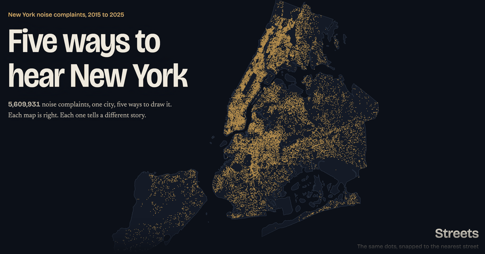
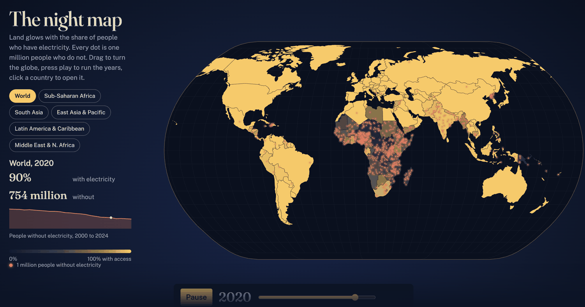
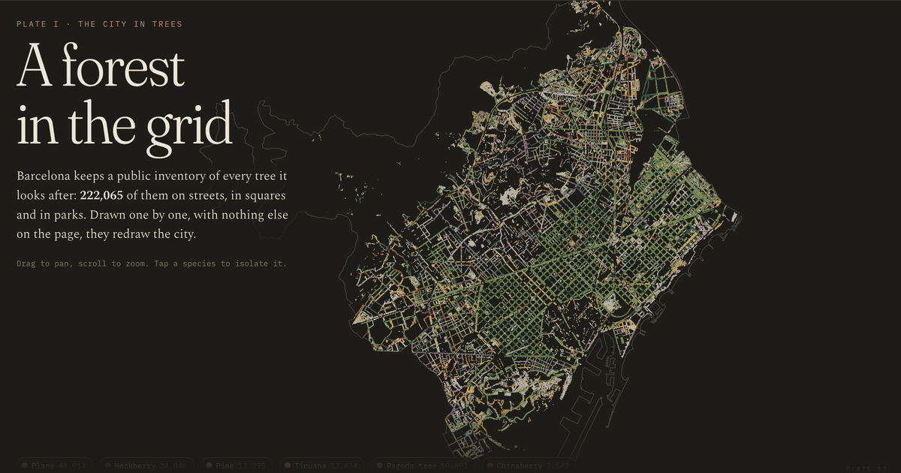

# databites-projects

**I'm [Josep Ferrer](https://databites.tech) — data scientist and visual educator based in Rotterdam.**  
This is where I publish my DataViz, data science, and AI projects. Real work. Shipped and public.

→ **[projects.databites.tech](https://projects.databites.tech)**

[](https://projects.databites.tech)

---

## What this is

A portfolio gallery that indexes every public project I build under the [DataBites](https://databites.tech) brand.

Each project gets its own subdomain (`five-ways-nyc.databites.tech`, `catalonia-atlas.projects.databites.tech`) and links back to this gallery. The gallery is intentionally simple: one `index.html`, no framework, no build step. Projects are loaded from `projects.json`, the single source of truth. To add a project, I add one object to `projects.json` and push. Both this site and [databites.tech](https://databites.tech) pull from the same file automatically.

---

## Live projects

### [Five ways to hear New York](https://five-ways-nyc.databites.tech)

[](https://five-ways-nyc.databites.tech)

One dataset, five maps. 5.6 million NYC 311 noise complaints, drawn by street, by border, by hour, by change over time and all at once. Each map is right. Each one tells a different story.

- **Data:** NYC 311 service requests, 2015 to 2025
- **Stack:** D3.js · Canvas · vanilla JS

### [After the lights came on](https://after-the-lights.databites.tech)

[](https://after-the-lights.databites.tech)

Since 2000, the number of people without electricity has halved. Did schooling and health follow? A scrollytelling story, a night map where land glows with access and every dot is a million people without it, and a country-by-country explorer.

- **Data:** UN System Data Commons, 2000 to 2024
- **Stack:** D3.js · TopoJSON · vanilla JS

### [A forest in the grid](https://forest-in-the-grid.databites.tech)

[](https://forest-in-the-grid.databites.tech)

Barcelona's 222,065 public trees, drawn one by one as a botanical atlas in five plates: the city in trees, six species, where the shade isn't, planting and felling, and climate shelters.

- **Data:** Open Data BCN tree inventory, CC BY 4.0
- **Languages:** EN · ES · CA (`?lang=en|es|ca`)
- **Stack:** Canvas · vanilla JS

### [Catalonia Income Atlas](https://catalonia-atlas.projects.databites.tech)

[](https://catalonia-atlas.projects.databites.tech)

An interactive choropleth map of income inequality across Catalonia — built because I wanted to understand the real shape of economic disparity in the place I'm from.

- **Data:** INE household income data, 2015–2023
- **Granularity:** 5,108 census tracts · 947 municipalities · 4 provinces
- **Stack:** MapLibre GL JS · Python (data processing) · GeoJSON

---

## Repo structure

```
databites-projects/
├── index.html              # The entire portfolio site
├── projects.json           # ← single source of truth for all projects
├── vercel.json             # Deployment config
└── images/
    ├── databitestech_logo.png
    ├── databitestech_logo_letters.png
    ├── databites_clearly_explained.png
    └── projects-headers/   # 1200×630px screenshots per project
        ├── five-ways-nyc.png
        ├── after-the-lights.png
        ├── forest-in-the-grid.png
        ├── popgrid.png
        └── catalonia-atlas.png
```

---

## How to add a project

Edit `projects.json` in the repo root. Add one object. Titles and descriptions are inline in the three languages, so there is nothing to touch in `index.html`:

```json
{
  "id": "your-project-id",
  "featured": true,
  "live": true,
  "year": "2026",
  "url": "https://your-project.databites.tech/",
  "screenshot": "https://projects.databites.tech/images/projects-headers/your-project.png",
  "tags": ["DataViz", "Maps"],
  "chips": [
    { "label": "D3.js",  "style": "green"  },
    { "label": "Python", "style": "forest" }
  ],
  "title": { "en": "Your project", "es": "Tu proyecto", "ca": "El teu projecte" },
  "desc":  { "en": "One or two sentences.", "es": "Una o dos frases.", "ca": "Una o dues frases." }
}
```

`featured: true` also shows the project on the [databites.tech](https://databites.tech) homepage grid (three cards per row, so keep it to three or six). `tags` drive the filter buttons: `DataViz`, `Maps`, `ML`, `Tools`. Add the screenshot to `images/projects-headers/` at 1200×630px, under 250KB. Push to `main`. Vercel deploys automatically.

---

## Deployment

Each project is a separate Vercel deployment with its own subdomain:

| Subdomain | Repo |
|---|---|
| `projects.databites.tech` | `databites-projects` (this repo) |
| `five-ways-nyc.databites.tech` | `five-ways-nyc` |
| `after-the-lights.databites.tech` | `after-the-lights` |
| `forest-in-the-grid.databites.tech` | `forest-in-the-grid` |
| `catalonia-atlas.projects.databites.tech` | `databites-atlas` |

DNS managed via Namecheap. CNAME records point to Vercel's DNS.

---

## Brand

Everything follows the [DataBites brand guidelines](https://databites.tech):

| Token | Hex | Use |
|---|---|---|
| Forest | `#1A3829` | Text, dark backgrounds |
| Green | `#2D9B4E` | Buttons, links |
| Bright | `#38B86E` | Accents, highlights |
| Mint | `#A8DDC4` | Tints, decorative |
| Cream | `#FAF6F0` | Page canvas |

Fonts: **Lilita One** (display) · **Space Grotesk** (body) · **Space Mono** (labels, code)

---

## About me

I'm a data scientist and educator who makes complex data and AI concepts click — through diagrams, writing, and interactive tools like these. I publish weekly at [databites.tech](https://databites.tech).

→ [Newsletter](https://reads.databites.tech) · [@iamjosepferrer](https://x.com/iamjosepferrer) · [LinkedIn](https://linkedin.com/in/iamjosepferrer)